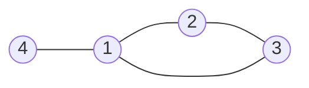

分类：基环树

## 题解

第一步需要转化题目，把具体的题目抽象化成一些数据结构。

对于按钮与灯之间的连接性，我们可以理解为一条边，多个灯之间相连，对于一次按钮操作，实际上就是让一条边连接的两个点进行转换，由0->1, 1->0

对于这样一个图，题目还告诉了我们一个细节，一共有n个点有n条边
n个点n条边可得该图为基环树，同时，有几个分量，就有几颗基环树

对于一颗基环树，我们能发现，边上会有度为1的点

如图，可见点4只有一个度，若点4为开灯状态，我们必须要触发 4-1 这个开关，让4变为关灯状态，此时4以及 4-1 这个开关我们都可以忽略讨论了。

以此方法去掉基环树上的树，便可获得一个环，此题就变为多个环的问题。

处理环

对于一个环，我们只需要选择任意一条边，对于这条边有两种情况，
使用和不使用，这属于两种情况，分别考虑并且断掉这条边，这个环就会变成一长条，便可直接处理。

至于代码怎么写，见ac-code.cpp

