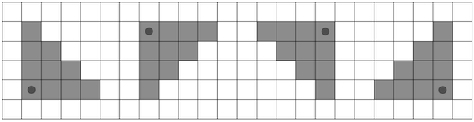

https://codeforces.com/contest/1921/problem/G

# G. Mischievous Shooter

有一次，调皮任性的射手谢尔发现自己在一个大小为 n×m
 的长方形场地上，场地被划分成一个个单元格。每个小格中都有一个目标或没有目标。

谢尔只带了一把幸运猎枪，他可以朝四个方向之一射击：右下、左下、左上或右上。射击时，霰弹枪会击中所选方向上的所有目标，这些目标的曼哈顿距离不会超过一个固定常数 k 。两点 (x1,y1) 和 (x2,y2) 之间的曼哈顿距离等于 |x1−x2|+|y1−y2|。

 k=3 的可能命中区域。
谢尔的目标是击中尽可能多的目标。请帮他找到这个值。

**输入**

每个测试由多个测试用例组成。第一行包含一个整数 $t$ ( $1 \le t \le 1000$ ) - 测试用例的数量。然后是测试用例的描述。

每个测试用例的第一行包含字段尺寸 $n$ 、 $m$ 和霰弹枪功率常数 $k$ ( $1 \le n, m, k \le 10^5, 1 \le n \cdot m \le 10^5$ )。

接下来的每行 $n$ 包含 $m$ 个字符--对下一行字段的描述，其中字符". "表示单元格为空，字符 "#"表示存在目标。

保证所有测试用例的 $n \cdot m$ 总和不超过 $10^5$ 。

